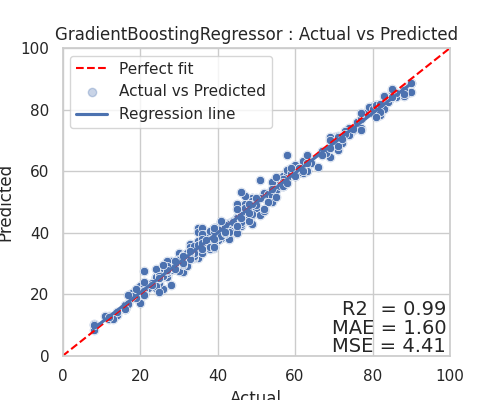
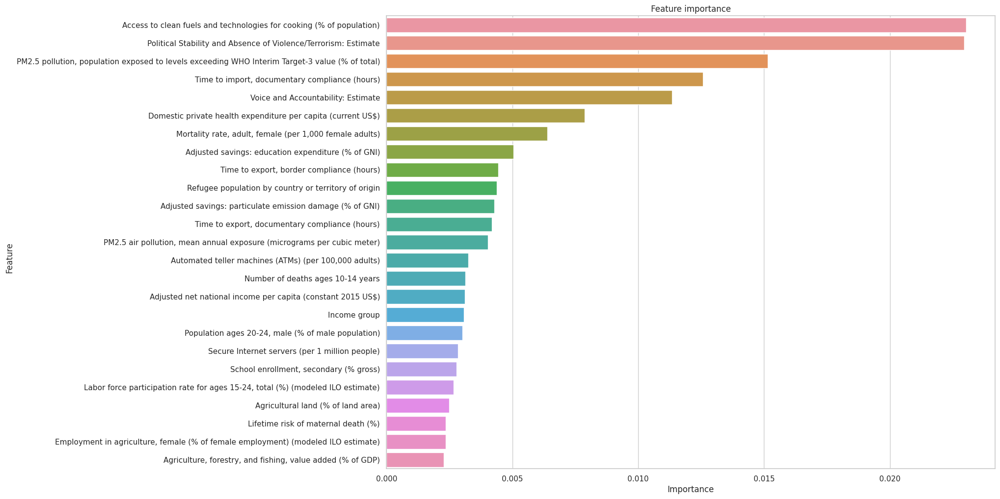

### Insights into Corruption: A Machine Learning Approach to Identify Influencing Factors

#### Initial Report and EDA

**Author**: Renaud Kilian
Data understanding and Preparation, Model building and Evaluation is provided in the [Notebook](Capstone1.ipynb).

#### Executive Summary

This project aims to identify and understand the various socio-economic and political factors influencing the Corruption Perceptions Index (CPI) at a country level. The exploration of these potential indicators might provide valuable insights into developing effective strategies to mitigate corruption and promote transparency and accountability in public sectors globally.

#### Rationale

Corruption is a pervasive issue that significantly affects economies and societies. Understanding its drivers is crucial for policy-making, international development, and global governance. This analysis can help in formulating more effective anti-corruption strategies and improving the transparency and accountability of public administrations worldwide.

#### Research Question

"Can we predict a country's Corruption Perception Index (CPI) using World Bank's Open Data indicators?"

"What are the most significant World Bank indicators that influence the Corruption Perception Index (CPI) in a country?"

This information would be vital in providing actionable insights for policy-makers and stakeholders aiming to mitigate corruption in various countries. By knowing which factors are most linked to corruption perception, targeted strategies can be developed to address those specific areas.

#### Data Sources

The necessary data will be sourced from the following:

1. [Corruption Perceptions Index (CPI)](https://www.transparency.org/en/cpi) - Transparency International
2. [World Bank Indicators](https://databank.worldbank.org/source/world-development-indicators) - World Bank's Open Data

#### Methodology

Our methodology will align with the CRISP-DM framework, this report covers the business aspects (Evaluation, and Deployment).

The technical [Notebook](Capstone1.ipynb) covers the remaining phases:

**Data Understanding:** We will gather the necessary data from various sources like Transparency International, World Bank's Open Data, World Justice Project, Reporters Without Borders, UNDP, and country-specific statistical agencies. Initial data exploration will help us understand the data's quality, completeness, and relevance to our research question.

**Data Preparation:** The collected data will be pre-processed and cleaned to handle missing values, outliers, and potential transformations. This phase includes data integration where data from different sources is combined, and feature engineering to create new variables if required.

**Modeling:** We plan to experiment with various regression models including Multiple Linear Regression, Decision Tree Regression, Random Forests, Gradient Boosting, and Ridge or Lasso. Feature selection techniques will be applied to identify the most relevant predictors.

**Evaluation:** Models will be assessed based on relevant metrics such as R-squared, Root Mean Squared Error (RMSE), and Mean Absolute Error (MAE). Cross-validation techniques will be used to ensure model robustness and avoid overfitting.

#### Conclusion
Upon conducting our analysis, we discovered a high degree of correlation among the indicators derived from the World Bank's Open Data. This presented a complex and delicate challenge when it came to filtering these indicators.

Despite this, our predictive models were successful in accurately predicting the Corruption Perceptions Index (CPI). The Gradient Boosting Regressor model outperformed the rest, demonstrating a Coefficient of Determination exceeding 0.98 (with 1 indicating a perfect fit).

##### Answering the research question

1. "Can we predict a country's Corruption Perception Index (CPI) using World Bank's Open Data indicators?"

Yes, the World Bank's Open Data indicators have substantial predictive power for the Corruption Perceptions Index (CPI)

2. "What are the most significant World Bank indicators that influence the Corruption Perception Index (CPI) in a country?"

Due to the high degree of correlation among the indicators, it is difficult to identify the most significant indicators. However, the following indicators were found to be the most influential:

1. Access to clean fuels and technologies for cooking (% of population)
2. Political Stability and Absence of Violence/Terrorism: Estimate
3. PM2.5 pollution, population exposed to levels exceeding WHO Interim Target-3 value (% of total)
4. Time to import, documentary compliance (hours)
5. Voice and Accountability: Estimate
6. Domestic private health expenditure per capita (current US$)
7. Mortality rate, adult, female (per 1,000 female adults)
8. Adjusted savings: education expenditure (% of GNI)
9. Time to export, border compliance (hours)
10. Refugee population by country or territory of origin
11. Adjusted savings: particulate emission damage (% of GNI)
12. Time to export, documentary compliance (hours)
13. PM2.5 air pollution, mean annual exposure (micrograms per cubic meter)
14. Automated teller machines (ATMs) (per 100,000 adults)
15. Number of deaths ages 10-14 years
16. Adjusted net national income per capita (constant 2015 US$)
17. Income group
18. Population ages 20-24, male (% of male population)
19. Secure Internet servers (per 1 million people)
20. School enrollment, secondary (% gross)
21. Labor force participation rate for ages 15-24, total (%) (modeled ILO estimate)
22. Agricultural land (% of land area)
23. Lifetime risk of maternal death (%)
24. Employment in agriculture, female (% of female employment) (modeled ILO estimate)
25. Agriculture, forestry, and fishing, value added (% of GDP)

##### Next Steps

These are excellent future steps to enhance your analysis and model performance. To summarize:

- Conduct an in-depth analysis of each indicator in the World Development Indicators (WDI) dataset to further refine the selection of significant indicators. This could involve more detailed statistical tests or applying feature selection techniques to identify the most relevant indicators for predicting CPI.

- Consider fine-tuning the Gradient Boosting Regressor model parameters using techniques such as GridSearchCV or RandomizedSearchCV. By exploring different hyperparameters, you may improve the predictive accuracy and reduce the error rate of your model.

- Reassess and refine your evaluation metrics to improve the relevance of the models and mitigate the impact of collinearity among the indicators. This could involve utilizing metrics that account for multicollinearity, like VIF (Variance Inflation Factor), or selecting more appropriate metrics based on the nature and distribution of your target variable (CPI).

By implementing these strategies, you could potentially enhance the predictive power and interpretability of your models.

##### Contact and Further Information

For any inquiries or further information, please reach out to [kilren@gmail.com](mailto:kilren@gmail.com).
